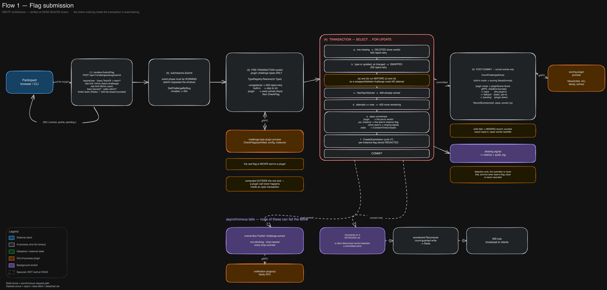
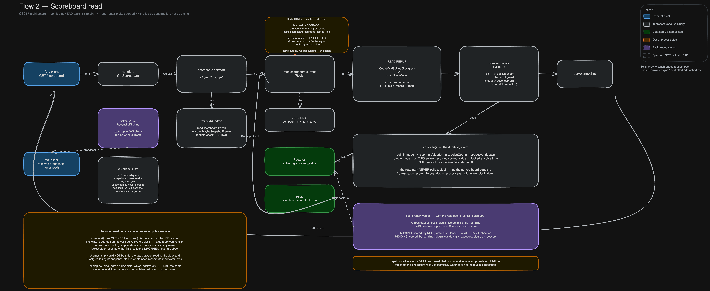
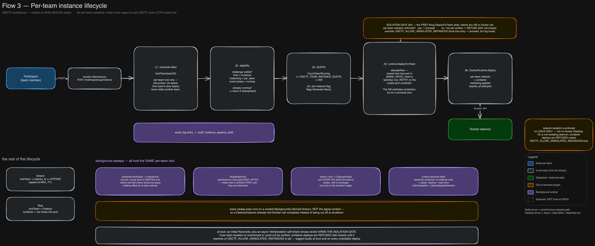
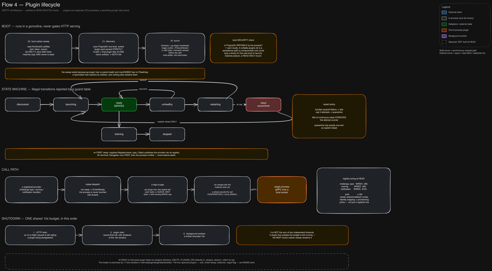

# OSCTF

An open, self-hostable platform for running cybersecurity competitions, labs, and training.

**What makes it different:** most CTF platforms hand every team the *same* shared challenge
instance. OSCTF gives each team its **own isolated container** — its own port, its own
network, an optional per-team unique flag — created on demand and lifecycle-managed by a
built-in **scheduler** (TTL, extend, per-team quota, automatic teardown at event end). That
per-team-instance model, not the scoreboard, is the reason to use it over a CTFd-class tool.

> **Per-team network isolation is enforced on Linux only — and container challenges now fail
> closed without it.** On **Docker Desktop (macOS/Windows)** per-team containers are reachable
> across networks once a port is published, so isolation is *not* enforced there. OSCTF now
> **refuses to start container instances** on any daemon whose per-team isolation it cannot
> verify (the isolation gate, [#2](https://github.com/osctf/platform/issues/2)); the only
> override is `OSCTF_ALLOW_UNISOLATED_INSTANCES=true`, for a **local trial only** and logged
> loudly. Run real events on a Linux host. Detail:
> [`docs/v0.2/03-runtime.md`](docs/v0.2/03-runtime.md).

CTFs are the entry point; the durable goal is to be the open infrastructure layer
universities, communities, and companies build their security education on. Vision and
roadmap: [`docs/project-desc.md`](docs/project-desc.md). One direction on that roadmap is
**AI-security challenges** — challenges whose target is a live LLM agent rather than a binary or web
app, attacked over multiple turns (roadmap, not shipped: [`docs/ai-challenges.md`](docs/ai-challenges.md)).

## How it works

One Go binary — a modular monolith — serves the JSON API **and** the embedded React dashboard,
with **Postgres** as the source of truth, **Redis** for ephemeral state (sessions, rate limits,
the board cache), **MinIO** for attachments, the host **Docker** daemon for per-team containers,
and **0..N out-of-process plugins** over gRPC. Read each top-to-bottom.

> **The editable [`docs/architecture/`](docs/architecture/) canvases are the source of truth.**
> The PNGs below are periodic exports that lag their source between renders — each caption stamps
> the commit it was exported from, so drift is visible rather than silent. If a PNG and its canvas
> disagree, the canvas wins. Sources are verified at `92c5755`.


<sub>Source: [`00-overview.excalidraw`](docs/architecture/00-overview.excalidraw) · PNG exported at `92c5755` · source verified at `92c5755`</sub>

<details>
<summary><b>Request flows</b> — flag submission, scoreboard read, per-team instances, plugin lifecycle (click to expand)</summary>

<br>

**Flag submission.** A plugin challenge-type's verdict is computed *before* the transaction — a
plugin call never happens inside the row lock. Inside `SELECT … FOR UPDATE` the deleted/swapped
checks run *before* the solved/attempt checks, so a challenge changed mid-submit costs no attempt.
The point value is recorded post-commit; the event-bus and notification tails are async and can
never fail the solve.



<sub>Source: [`01-flow-submission.excalidraw`](docs/architecture/01-flow-submission.excalidraw) · PNG exported at `92c5755` · source verified at `92c5755`</sub>

**Scoreboard read.** Read-repair makes *served == the solve log* by construction rather than by
timing. Plugin scores are **locked at solve** and read from a per-solve record, so the served board
equals a from-scratch recompute over the log **even with every plugin down**; a background worker
backfills missing/pending records off the read path.



<sub>Source: [`02-flow-scoreboard.excalidraw`](docs/architecture/02-flow-scoreboard.excalidraw) · PNG exported at `92c5755` · source verified at `92c5755`</sub>

**Per-team instance lifecycle** — the reason to use OSCTF over a CTFd-class tool. Per-team locking,
quota, DB-arbitrated port allocation, container hardening, and background sweeps (expiry, reap,
reconcile) that all take the same per-team lock.



<sub>Source: [`03-flow-instance.excalidraw`](docs/architecture/03-flow-instance.excalidraw) · PNG exported at `92c5755` · source verified at `92c5755`</sub>

**Plugin lifecycle.** Boot runs in a goroutine and never gates HTTP serving; an 8-state supervisor
with guarded transitions; register-on-ready / revert-before-death; a two-level in-flight budget; and
an ordered shutdown (HTTP drain → plugin drain → background workers) under one shared budget.



<sub>Source: [`04-flow-plugin.excalidraw`](docs/architecture/04-flow-plugin.excalidraw) · PNG exported at `92c5755` · source verified at `92c5755`</sub>

</details>

## Quick start

```bash
git clone https://github.com/osctf/platform && cd platform
cp .env.example .env

# Change OSCTF_ADMIN_PASSWORD (default: change-me-now) before exposing this to anyone.

# On Linux, give the platform access to the host Docker socket group, or every
# container challenge fails at instance-start time. (Docker Desktop doesn't need this
# GID — but it can't isolate per-team networks, so container challenges are refused
# there by default regardless; see the note above.)
echo "OSCTF_DOCKER_GID=$(stat -c '%g' /var/run/docker.sock)" >> .env

docker compose up -d --build --wait
```

Then open <http://localhost:8080>: authentication, teams, a challenge board with seeded
examples, flag submission with scoring, a live scoreboard, and an admin panel. No cloud
account, no license key, no external services.

> **The platform mounts the host Docker socket** to launch challenge containers, which is
> **root-equivalent on the host.** Run events on a dedicated host/VM. See
> [`docs/v0.1/08-challenge-runtime.md`](docs/v0.1/08-challenge-runtime.md).

The security posture — the adversaries, what each can reach, and what is defended vs. explicitly
accepted — is in [`THREAT_MODEL.md`](THREAT_MODEL.md); report vulnerabilities via
[`SECURITY.md`](SECURITY.md).

## Running a real event

The quickstart is fine for a local trial; before an actual event, read
[`docs/v0.1/10-deployment.md`](docs/v0.1/10-deployment.md). The notes people most often miss:

- **Linux host** — for the per-team isolation above, and set `OSCTF_DOCKER_GID` to the
  socket's group.
- **Large scoreboards** — each live scoreboard WebSocket is a file descriptor;
  `OSCTF_WS_MAX_CONNS` is clamped to `RLIMIT_NOFILE`, so raise the host ulimit
  (e.g. `LimitNOFILE=65536`) and size the cap accordingly for a few thousand viewers.
- **Shared-NAT venues** — the per-IP register/login limits default generous so a campus or
  venue behind one NAT can all sign in at event start; tighten `OSCTF_REGISTER_IP_*` /
  `OSCTF_LOGIN_IP_*` for a public-internet deployment.
- **Instance tuning** — `OSCTF_INSTANCE_TTL` / `_EXTEND` / `_MAX_TTL` / `_REAP_AFTER`,
  `OSCTF_TEAM_INSTANCE_QUOTA`, `OSCTF_PORT_RANGE_START` / `_END` (default `30000`–`32767`,
  which must be open on the host). All settings are documented in
  [`.env.example`](.env.example).

## Local development

```bash
make setup      # install pinned tools + dashboard deps
make dev        # start Postgres, Redis, MinIO (compose)
make dev-api    # run the Go API on :8080
make dev-web    # run the Vite dev server on :5173 (proxies /api -> :8080)
```

- API <http://localhost:8080> · Web (dev) <http://localhost:5173> · MinIO console <http://localhost:9001>

## Tests

```bash
make test              # unit (Go -short + web)
make test-integration  # integration (testcontainers spin up Postgres/Redis/MinIO)
make smoke             # build the stack, run the end-to-end smoke test, tear down
```

The testing tiers, build tags, and the invariants they pin are described in
[`AGENTS.md`](AGENTS.md); CI runs all of it (plus a compose smoke and Playwright e2e) on
every push.

## Layout

| Path | What |
|---|---|
| `api/` | Go backend (modular monolith): HTTP, services, stores, challenge runtime, scheduler |
| `dashboard/` | React + TypeScript SPA (Vite) |
| `examples/` | Seeded example challenges (`challenge.yaml` format) |
| `deploy/` | Prometheus / Grafana / Caddy configs (optional compose profiles) |
| `docs/` | Versioned build specs (`v0.1` → `v1.0`) + guides — start at [`docs/README.md`](docs/README.md) |
| `scripts/` | Smoke test and dev helpers |

## Status

**Latest release: see [Releases](https://github.com/osctf/platform/releases)** and the
[CHANGELOG](CHANGELOG.md). Shipped: **v0.1** (MVP) → **v0.2** (per-team instances + scheduler),
hardened across **v0.2.1** (security), **v0.2.2** (concurrency), and **v0.2.3** (scoreboard
consistency by construction).

**In progress on `main` — v0.3:** the canonical **`/api/v1`** surface (with `/api/v0` kept as a
deprecated alias) and the **out-of-process plugin system**. Built and verified in the diagrams
above: the plugin **loader** (discovery, an 8-state supervisor, a two-level in-flight budget,
ordered drain) and its **challenge-type**, **scoring**, and **notification** wiring. Remaining:
**auth** plugins (redirect/OAuth), the first-party plugin set, and API v1's full stability
guarantees. Specs: [`docs/v0.3/`](docs/v0.3/README.md) · [`docs/v0.3.1/`](docs/v0.3.1/README.md).
There are no API stability promises before v1.0.

**On the roadmap — AI-security challenges (design, not built).** A challenge family where the target
is a live **LLM agent** — a system prompt, optional tools, an optional retrieval corpus — that a
competitor attacks over multiple turns (prompt injection, indirect injection, tool abuse, guardrail
bypass, system-prompt extraction) instead of submitting a static flag. It is a `ChallengeType` plugin,
not a core change. The design, the scoring model (deterministic vs graded, and why deterministic is
preferred), the cost and isolation limits, and the ABI extensions it requires are in
[`docs/ai-challenges.md`](docs/ai-challenges.md). It is a design, not a feature.

## License

[Apache License 2.0](LICENSE). Contributions are accepted under the same license (see
[`NOTICE`](NOTICE)).
